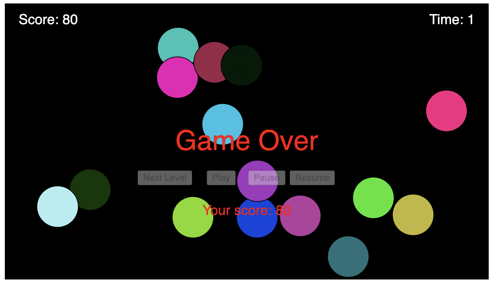

# Bubble Blitz

## Core Theme

The core theme of Bubble Blitz is all about popping bubbles for fun and points! In this game, colorful bubbles float across the screen, and the goal is to pop as many as possible within the time limit. The more bubbles you pop, the higher your score. It's a simple yet exciting challenge that invites players to enjoy the thrill of bursting bubbles and see how high they can score.

## Objective

The main goal in Bubble Blitz is to score as many points as possible by popping bubbles within a limited time frame. However, the game doesn't stop there. This introduces a layer of strategy, encouraging players to find the right balance between speed and precision.

Bubbles: Colorful bubbles appear on the screen, each with a specific radius and movement pattern.

Scoring: Players earn points by clicking on bubbles. The game introduces a combo system, where consecutive successful hits increase a combo multiplier, boosting the score.

Combo System: Successfully popping bubbles in quick succession builds up a combo. As the combo increases, the combo multiplier rises, providing an opportunity for higher scores.

Levels: The game consists of ten levels, each progressively more challenging. Players advance to the next level upon successfully popping all the bubbles in the current level.

Time Limit: Players must complete each level within a specified time limit. The timer adds a sense of urgency and difficulty to the gameplay.

Winning and Losing: The game provides a win condition when players complete all levels, congratulating them on their success. Conversely, running out of time results in a game over, ending the player's current session.

## Influences

At first, my intention was to develop a game inspired by Bubble Trouble. The original concept involved a character shooting a line into the air to split bubbles into two smaller parts. However, as I began working on it, I recognized the complexity of the idea. Realizing the challenges involved, I opted for a modified approach, leading to the creation of Bubble Blitz.

## Aesthetics

The aesthetic design of Bubble Blitz revolves around vibrant visuals to create an engaging and visually appealing gaming experience. The bubbles, the central elements of the game, are adorned with a diverse range of colors, creating a lively and cheerful atmosphere. Each bubble pops into a burst of randomly generated hues, adding a touch of excitement.

The background complements the energetic nature of the game with a sleek and dark backdrop, enhancing the visibility of the colorful bubbles as they appear on the screen. The contrasting color scheme ensures that players can easily distinguish the bubbles and their respective states, such as when they are hit or remain untouched.

The overall design aims to strike a balance between simplicity and playfulness. The clean and intuitive layout allows players to focus on the primary action – popping bubbles – while the dynamic color palette and animations inject a sense of liveliness into the game. The aesthetic choices aim to cater to a broad audience, making Bubble Blitz visually appealing and accessible to players of all ages.

## Mechanics

 Players interact by clicking on bubbles to pop them, testing their hand-eye coordination. As you progress through levels, the speed of the bubbles increases, making it harder. The combo system introduces an additional layer of depth, rewarding skillful players with score multipliers and adding strategic depth to the gameplay.

Additional Features:
1. Pause and Resume:
Players can pause the game to take a break and resume when ready.
2. Next Level:
After successfully completing a level, players can proceed to the next level, facing increased difficulty.
3. Game Over and Level Won:
The game ends if the timer runs out, displaying the player's score.
Upon winning a level, players receive a congratulatory message and can choose to proceed or start a new game.
4. Background music ; 
The background music stops once you have won a level and restarts when you go onto the next level. 

## Images

Given more time and resources, there are several ways I could extend the "Bubble Blitz" game:

I would :

Expand the game with more levels, each introducing new challenges, bubble types, and obstacles and  unique and themed levels that increase in complexity as the player progresses.

Create special types of bubbles with unique properties, such as bonus points, exploding bubbles, or bubbles that split into smaller ones.

Enhance the audio experience with a variety of sound effects for bubble pops, power-ups, and level transitions.

I tried to add the pop sound everytime the bubble pops but i could not figure out.

References :
1. https://p5js.org/examples/motion-bounce.html
2. https://editor.p5js.org/b0802844@students.katyisd.org/sketches/ByFxw7Ah7
3. Getting-Started-with-p5js-MAKE.pdf
4. https://github.com/anthillsocial/Coding-for-the-arts/tree/main
