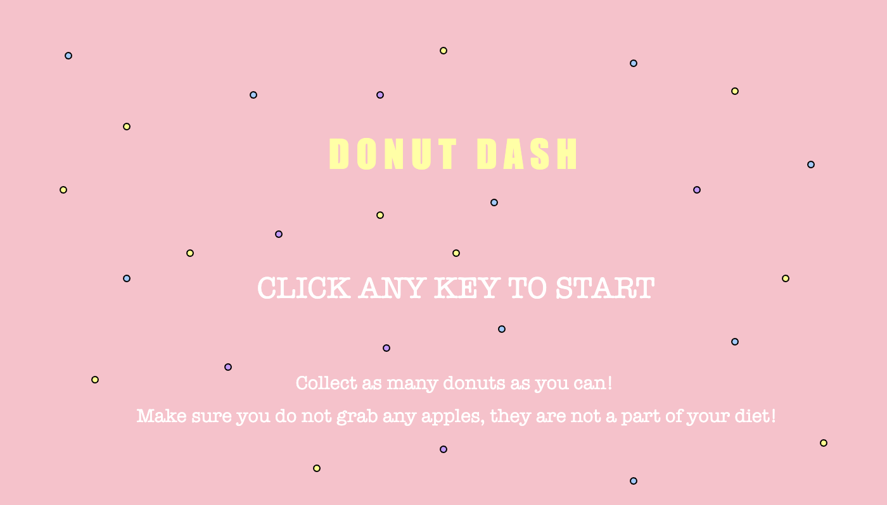

# Coding for the Arts final project - DONUT DASH

## IDEA
For my final project, I was inspired by the stereotype that police officers love to eat donuts. Growing up, I used to play a game where when the police caught the thief, he would get a donut. I thought about that while I was trying to come up with a video game idea. 

While using that as my main inspiration, I devised a game where the police officer has to catch as many donuts as possible. This game has no winning objective, but when the player accidentally catches an apple, they lose. Even though this is a straightforward and 'innocent' game, there is a bit more behind it. The background of the game shows a statistic of the number of people shot to death by the police in the United States within the years 2017 and 2023 by race. This contradicts the silly game and gets the player thinking about how police forces, who are supposed to protect us, are just promoting violence and police brutality. 

Additionally, with the statistics in the background, the police are chasing donuts. This shows the player how little police care about who they hurt and kill, and most of the time, with unjustified reasonings. In this case, all the police care about is his donuts. 

## AESTHETICS
To add to the simplicity of the idea, I decided to keep the donuts, apples, and police looking very simple. This also ensures that not too much is going on on the screen and allows the player to observe the background properly.

For the lobby of the game, I went with a donut theme. The pink background represents the icing, and I included sprinkles throughout the canvas. This cheerful and innocent theme of the lobby adds a surprise element when the player sees the game's background and understands its deeper meaning. It emphasizes the importance of acknowledging police brutality. 

On the contrary, the screen that pops up when the player loses has a black background and projects 'game over' in red. The red circles mimic blood splatters. This is very different from the theme of the lobby, as the harsh colors represent 'death,' like in shooting games, for example. This great contrast gets the player thinking about those who were shot dead by the police.

## THE PROCESS
When the game is opened, the player is in the lobby, which projects the name of the game and quick instructions. When any key on the keyboard is pressed, the game begins. I achieved this with the 'keyPressed' and 'splashScreen' functions.

The most straightforward aspect of the coding was designing the donuts, police, and apples. It is a pretty clear process.

Then, I used the GitHub example with baddies to make the donuts fall down the screen. 

I considered different ways the police could catch the donuts, but the most logical was to have the police move across the x-axis at the bottom of the screen. It moves left and right with the mouse. To do this, I set the x coordinate as 'mouseX'. 

When the police hits the donut (comes in contact with it), the donut is caught (so it disappears). This was achieved using a collision and the 'if' function. 

The same goes for the apples, but when the player catches an apple, the game ends (achieved with an 'if/else' function). The screen changes to a black one that projects the words 'game over.'

I had some difficulties making the apples fall down the screen. At first, only one would fall, but after trying multiple code variants, I managed to have them fall the way I wanted. 

