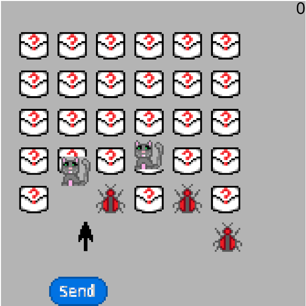

# MA1805 [REmailing}

 

# Interaction
My project is interacted firstly through the mouse, clicking the buttons to open either the instructions page or start the game. From the instructions page, the escape/ESC key must be used to return to the menu. When starting the game, use of either the arrow keys of up for shooting, left for strafing left and right for strafing right is permitted in addition to the mouse's position alternatively controlling what action occurs. 

# Objectives
The primary objective of my game is to gain as high a score as possible from opening envelopes, with further objectives being to avoid cats while destroying bugs contained within them. 

# Creative Decisions
My creative decisions came from my inspirations. My first inspiration was space invaders, of which my code is derived from a P5.js project of (linked below). Although the core gameplay is rather simple, for my project I aimed to expand it to be slightly more complex with extra mechanics, which I have succeeded in. 

My second key source of inspiration was emailing and the mundanity of it. While it appears mundane, the dangers that are actually involved in the opening of emails are there if not apparent, with risks of scams, phishing, malware and viruses all from merely opening emails and/or their attachments. From such I derived my objects of the game, the envelopes with their neutral nature of neither negative nor positive until opened, the bugs as enemy stand ins representative of the harm emails can cause, and cats as positive content for the envelopes given the internet's obsession with cats through meme culture. 

# How could this be extended?
Given more time and resources, I would love to add animations to the opening of envelopes, let alone an email UI-like dashboard background for the main game. Another possible addition would be allowing replaying when the game is over or exiting to the menu mid-game, especially since I had tried the latter but it led to a bug with the menu text shifting awkwardly.

(Link to Space Invaders example) https://editor.p5js.org/kleinesfilmroellchen/sketches/BkE1_Lh0X